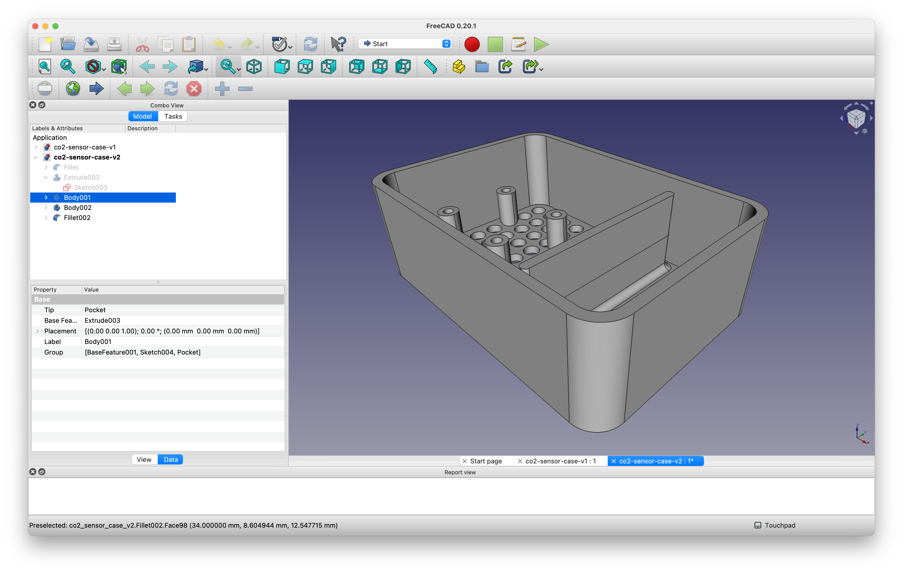
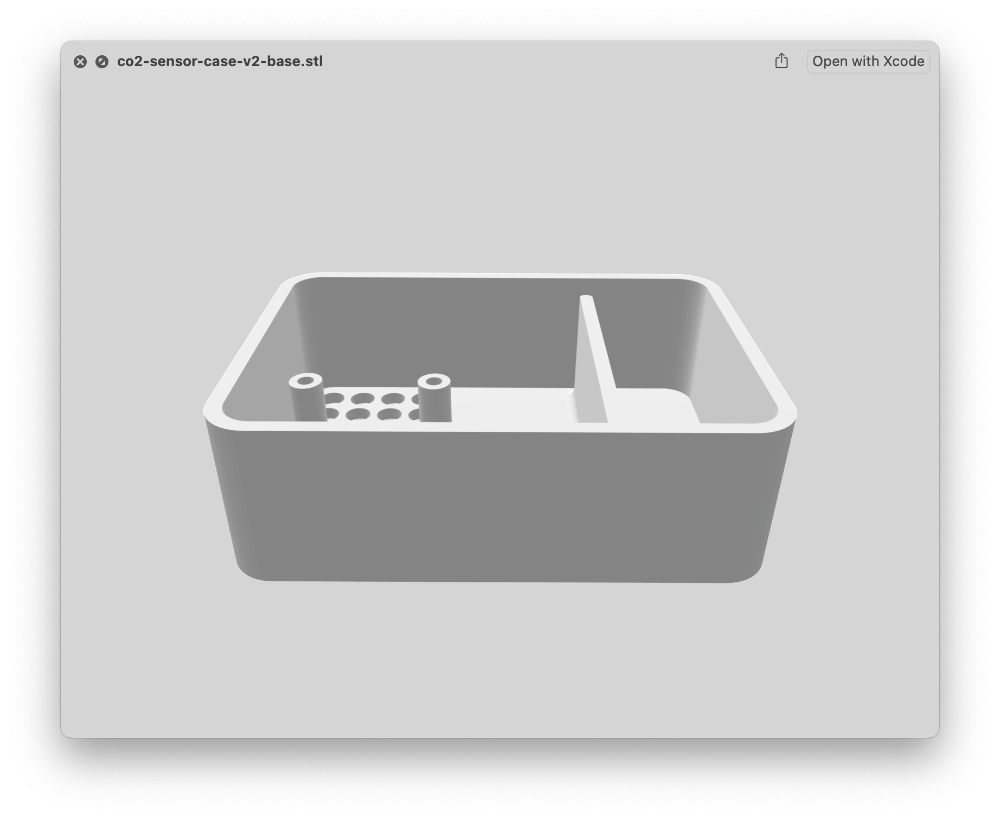
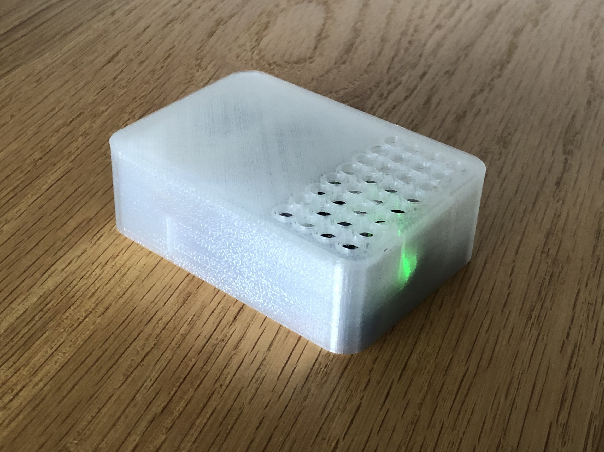
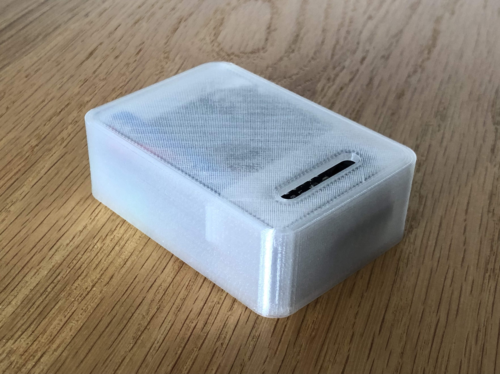
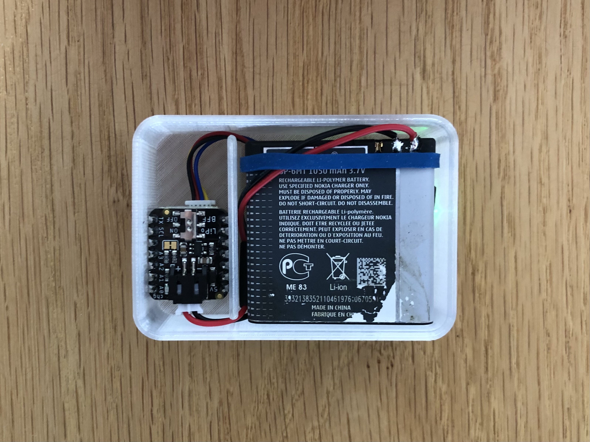
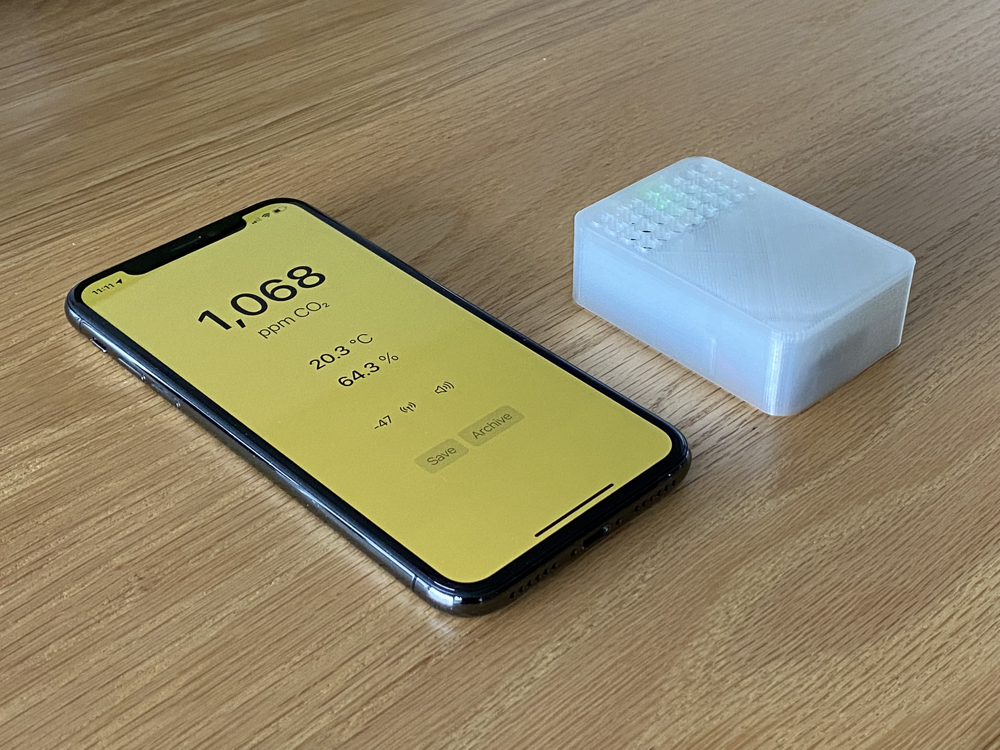

# CO2 sensor case

A 3D printable case for Sensirion SCD-41 CO2 sensor, QT Py ESP32, and Nokia battery.

## Design files

I first mocked up the layout in 2D using InDesign, then moved into [FreeCAD](https://www.freecadweb.org) for the 3D design.

## Related projects

* [Arduino code for ESP32-C3 QT Py](https://github.com/sighmon/co2_sensor_scd4x_esp32_http_server/tree/add/4-adafruit-qt-py-esp32-c3)
* [iOS/macOS app](https://github.com/sighmon/ios-ble-co2-sensor)

## TODO

- [ ] Increase ESP32 compartment by ~0.5mm
- [ ] Fix SCD-41 mounting position
- [ ] Add USB-C charging slot
- [ ] Add smiley face ontop cover

